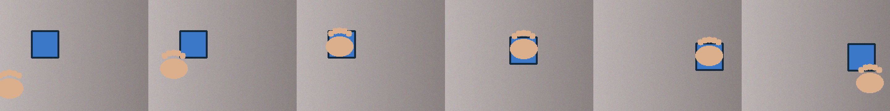
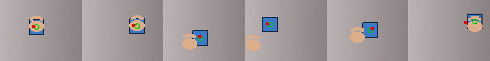
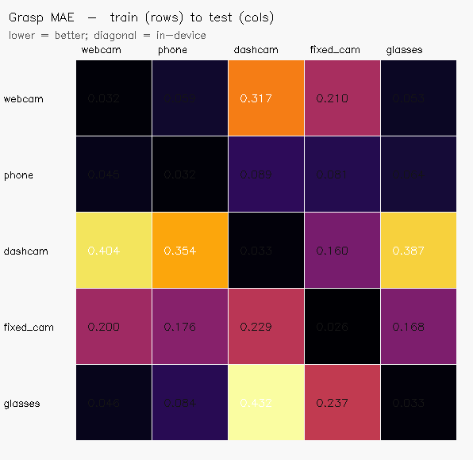
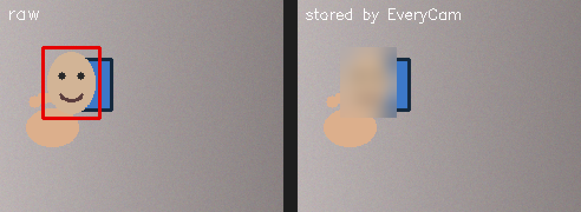

<div align="center">

# EveryCam

### *Every camera is a robot teacher.*

Turn any everyday camera — **webcam, phone, dashcam, fixed/CCTV-style, or smart glasses** — into
**privacy-first, robot-ready embodied-AI data**. No robot. No GPU. No special rig.

[](https://github.com/AravindB98/everycam/actions/workflows/ci.yml)
[](LICENSE)
[](https://www.python.org/)
[](PRIVACY.md)


</div>

---

> 🎓 **New to this? Start with the [plain-English explainer](docs/EXPLAINER.md)** — written so a
> middle-schooler can follow it, no tech background needed. There's also a friendly
> [project website](https://AravindB98.github.io/everycam/) with a no-code way to contribute.

**In plain English:** EveryCam turns ordinary videos (webcam, phone, dashcam, smart glasses) into
"lessons" that robots can learn from — automatically blurring faces so privacy is protected. Robots
struggle to learn everyday physical skills because practicing on real robots is slow and costly;
human video from cheap, everyday cameras is the abundant alternative, and EveryCam is the tool that
converts it — responsibly.

## Why EveryCam?

The hardest bottleneck in **Physical AI** isn't model architectures — it's **robot training data**.
Today that data comes from expensive teleoperation and robot farms. The frontier answer in 2026 is to
**learn from ordinary human video**: Meta's [V-JEPA 2](https://ai.meta.com/blog/v-jepa-2-world-model-benchmarks/)
showed zero-shot robot control from a single RGB camera, and Apple's
[EgoDex](https://arxiv.org/abs/2505.11709), Meta's [Ego-Exo4D](https://ai.meta.com/blog/ego-exo4d-video-learning-perception/),
and the [LeRobot](https://github.com/huggingface/lerobot) ecosystem are racing to convert human video into robot intelligence.

But those are **giant datasets from big labs** or **single-paper methods tied to special hardware**. The simple,
responsible **capture → standardize** tool for the cameras you *already own* has been missing. That's EveryCam:

> **Point any everyday camera at people doing everyday things → get a clean, anonymized, LeRobot-style dataset
> a robot policy can actually train on.**

EveryCam treats a **human hand as a proxy end-effector**: it tracks the hand, reads hand–object contact and grasp
affordances, and emits the exact `(observation, action)` format imitation-learning / VLA policies consume — with
**faces and license plates blurred before anything is written to disk.**

---

## What makes it different

| | EveryCam | Big-lab egocentric datasets | Single-paper methods |
|---|---|---|---|
| Works with **commodity cameras** | ✅ webcam/phone/dashcam/fixed/glasses | ⚠️ fixed capture rigs | ⚠️ Vision Pro / Aria |
| **Privacy enforced** (blur-before-store + provenance) | ✅ first-class | ❌ usually raw | ❌ |
| **Runs on a CPU laptop, end-to-end** | ✅ | ❌ | ❌ |
| **LeRobot-style output** | ✅ | ⚠️ varies | ⚠️ |
| A **tool** you run, not a download | ✅ | ❌ (a dataset) | ❌ (a paper) |

EveryCam isn't claiming to invent the science — it's the missing, responsible **plumbing**, the way `ffmpeg` and
`LeRobot` are plumbing. That is exactly the layer the field is short on.

---

## Supported inputs

| Preset | Source | Privacy defaults | Typical use |
|---|---|---|---|
| `webcam` | laptop/USB camera | blur faces | record your own demos |
| `phone` | recorded video file | blur faces + plates | handheld manipulation clips |
| `dashcam` | driving video file | blur faces + **plates** | driving-scene / ego-motion data |
| `fixed_cam` / `cctv` | RTSP / HTTP stream | blur faces + plates (strong) | overhead "activity" data (consented/public) |
| `phone_ip` | phone as a wireless cam (IP Webcam app) | blur faces + plates | live phone capture |
| `glasses` | egocentric video file | blur faces + plates | first-person manipulation |
| `ipcam` / `rtsp` | IP / RTSP network camera | blur faces + plates (strong) | networked cameras |
| `gopro` | action-cam video / UVC mode | blur faces + plates | action-cam egocentric |
| `frames` | a folder of image frames | blur faces + plates | pre-extracted frames |

**Full how-to-connect guide for every platform:** [docs/CAMERAS.md](docs/CAMERAS.md).

> EveryCam **never** links footage to identity and has no face-recognition or ID-matching capability. See [PRIVACY.md](PRIVACY.md).

---

## Quickstart

```bash
git clone https://github.com/AravindB98/everycam.git
cd everycam
pip install -e .            # core: numpy + opencv only (runs on any laptop)

# Full end-to-end demo — no hardware, no GPU, no network:
everycam demo
```

The demo builds synthetic everyday-camera episodes, anonymizes + perceives + exports a LeRobot-style dataset,
then trains a tiny CPU model and prints metrics:

```text
[everycam] building 16 synthetic episodes -> runs/demo/dataset
[everycam] privacy gate ran on every frame (identity never stored)
[everycam] training affordance + contact model (400 epochs, CPU)
{
  "grasp_mae_px": 7.0,
  "contact_accuracy": 0.93,
  "improvement_vs_baseline_pct": 68.6
}
```

Use real footage instead:

```bash
everycam capture --preset webcam                      # your laptop camera
everycam capture --preset dashcam --path drive.mp4    # a dashcam clip
everycam capture --kind stream  --path rtsp://CAM/ID  # a fixed / CCTV-style camera
everycam record  --seconds 5 --preset webcam          # countdown, then record 5s and save
everycam capture --preset webcam --hands mediapipe    # 3D hand tracking (pip install -e ".[hands]")
everycam info  runs/capture/dataset                   # schema + provenance
everycam backends                                     # which optional backends are installed
```

Optional upgrades (the core never requires them):

```bash
pip install -e ".[hands]"   # MediaPipe 21-landmark hand tracking
pip install -e ".[data]"    # pandas + pyarrow → parquet (LeRobot-native) export
pip install -e ".[torch]"   # swap the numpy model for a CNN
```

---

## How it works

```
camera ─▶ Privacy gate ─▶ Perception ─▶ Embodied signals ─▶ LeRobot-style dataset ─▶ Tiny model
         blur faces/      hands, objects,  hand→proxy actions,   parquet + images       grasp + contact
         plates first     ego-motion       grasp affordances     + provenance
```

Every stage degrades gracefully: MediaPipe hands if installed, otherwise a dependency-free skin-segmentation
fallback; parquet export if `pyarrow` is present, otherwise JSONL; a CNN if you install `torch`, otherwise a
pure-numpy model. **That's why the whole thing runs on a bare laptop.**

### Sample frames (synthetic "hand manipulates object")


---

## Jargon, decoded

New to the field? Plain-English definitions (the full version lives in the [explainer](docs/EXPLAINER.md)):

- **Physical AI / Embodied AI** — AI that acts in the real world (robots), not just text on a screen.
- **VLA (Vision-Language-Action)** — a model that looks, reads an instruction, and outputs robot actions.
- **Affordance** — "where do I grab this / what can I do with it?"
- **Imitation learning** — a robot learning by copying a human demonstration.
- **Egocentric video** — first-person video (what a head- or chest-worn camera sees).
- **LeRobot** — Hugging Face's popular format + tools for robot datasets; EveryCam exports to it.
- **World model** — an AI's "imagination" that predicts what happens next in a scene.
- **Anonymization** — removing identifying details; here, blurring faces/plates *before* saving.

## Results (bundled synthetic benchmark)

A **pure-numpy model** (ridge grasp head + tiny MLP contact head, trains in seconds on CPU) learns from the
exported dataset and is evaluated on a held-out split:

| Metric | Score |
|---|---|
| Grasp localization error | **~7 px** (240×180 frame) |
| Improvement vs. predict-the-mean baseline | **~69%** |
| Hand–object contact accuracy | **~93%** |

Predicted grasp (red) vs. ground-truth grasp (green) on held-out frames:



> These numbers are on the bundled **synthetic** benchmark — they exist to prove the data is genuinely learnable
> end-to-end and the pipeline is correct, not to claim real-world SOTA. Plugging in MediaPipe + real footage is one flag away.

---

## Multi-device generalization benchmark

Real deployments capture the same action on very different cameras. EveryCam ships a
**cross-device benchmark** that simulates five device domains (webcam, phone, dashcam,
fixed/CCTV, glasses), trains the affordance model on each, and tests it on all of them —
putting a number on the *generalization gap* that egocentric robot learning keeps hitting.

```bash
everycam benchmark        # no hardware; builds the transfer matrix below
```



On the synthetic benchmark, in-device grasp error is **~0.03** but cross-device error is
**~0.19 — roughly 6× worse** when the train and test cameras differ. The structure is
intuitive: webcam / phone / glasses transfer reasonably to one another, while the dashcam
(motion blur + low contrast) and fixed/CCTV (desaturated, low-res, noisy) domains are far
harder. That gap is exactly the open problem a domain-robust capture layer should attack —
and now there's a number to drive down.

## World model (a peek at imagination)

EveryCam also ships a tiny **latent world model** (`everycam worldmodel <dataset>`): it learns one-step
forward dynamics — given the current frame's features and the action, predict the *next* frame's features —
then "imagines" several steps ahead by feeding its own predictions back in. On the synthetic benchmark it
beats the "nothing moves" baseline by ~3% at one step and **~6–7% over a 5-step rollout** (the gap grows
with the horizon — the point of a world model). Same idea as video world models like V-JEPA 2, shrunk to a
closed-form model that trains instantly on CPU.

## Capture in three ways

1. **Web app** — the [in-browser recorder](https://AravindB98.github.io/everycam/record.html) opens your
   camera, records for a few seconds, and turns motion into signals **on-device** (the video never leaves your
   machine). It's an installable **PWA** — "Add to Home Screen" and it behaves like an app.
2. **One command** — `everycam record --seconds 5` (countdown, record, anonymize, save).
3. **Files / streams** — `everycam capture --preset <phone|dashcam|ipcam|…>` for recorded clips or live
   network cameras.

## Privacy by design



Anonymization is **not optional and not last** — every frame passes through the privacy gate *before* perception
and *before* storage. Datasets carry a `meta/everycam.json` record of provenance, consent, and the fact that
anonymization ran. EveryCam has **no** capability to identify, match, or track individuals. Full policy in
[PRIVACY.md](PRIVACY.md).

---

## Contribute real data from your device

EveryCam is built to grow from a synthetic demo into an **open, community-sourced** dataset of
everyday-camera embodied data — and you can add to it from your own webcam, phone, dashcam, or
glasses. Contribution is **consent-gated**: every submission must carry consent, a license, and
`anonymized: true`, or it is rejected.

```bash
everycam capture --preset webcam --out runs/mine/dataset     # anonymized capture
everycam analyze runs/mine/dataset                           # stats + quick model eval
everycam contribute --dataset runs/mine/dataset --id my-pours \
  --title "Pouring water" --contributor <you> --device webcam \
  --task "pour water" --consent self --license CC-BY-4.0 \
  --data-mode in_repo --i-have-rights                        # then open a PR
```

Contributions live in a [`registry/`](registry/) (designed so a web upload portal can sit on top
later) in two forms: **hosted** (publish your anonymized data to Hugging Face/Zenodo and register
a link) or **in_repo** (a tiny *signals-only* bundle — never raw frames). A CI workflow runs
`everycam validate` on every data PR, and `everycam aggregate` pools every contribution into a
live community report → [`registry/REPORT.md`](registry/REPORT.md). Full guide:
[CONTRIBUTING-DATA.md](CONTRIBUTING-DATA.md).

## Dataset format

EveryCam writes a [LeRobot](https://github.com/huggingface/lerobot)-style layout so it drops into that ecosystem:

```
dataset/
├── meta/
│   ├── info.json          # feature schema, fps, totals
│   ├── episodes.jsonl     # one row per episode
│   ├── tasks.jsonl        # task_index → task
│   └── everycam.json      # provenance + consent + anonymization record
├── data/chunk-000/
│   └── episode_000000.parquet   # observation.state, action, affordance, contact, ...
└── images/episode_000000/frame_000000.png ...
```

Key features: `observation.state = [ee_x, ee_y, contact]`, `action = [dx, dy, dcontact]`,
`observation.affordance_xy = [grasp_x, grasp_y]`, plus standard LeRobot index/timestamp columns.

---

## Roadmap

- [x] Community data registry + consent-gated `contribute` / `validate` (real device data)
- [x] Multi-device generalization benchmark (`everycam benchmark`)
- [x] MediaPipe hand backend (`--hands mediapipe`) — 6-DoF proxy actions next
- [ ] Monocular depth (Depth-Anything) → 3D affordances
- [ ] Native LeRobot `mp4`-video export + one-line `LeRobotDataset` loader
- [ ] DNN face/plate detector option for the privacy gate
- [x] World-model head — latent forward dynamics + rollout (`everycam worldmodel`)
- [x] In-browser recorder + installable PWA + `everycam record` (timed capture)

---

## Related work

V-JEPA 2 · EgoDex · Ego4D / Ego-Exo4D · OpenEgo · DROID · Open X-Embodiment · LeRobot · HaMeR.
EveryCam is positioned as the **commodity-camera, privacy-first capture layer** feeding this ecosystem.

## Contributing

Contributions welcome — see [CONTRIBUTING.md](CONTRIBUTING.md) for code, and
[CONTRIBUTING-DATA.md](CONTRIBUTING-DATA.md) to contribute **real data from your device**. Good
first issues: new source adapters, a DNN privacy backend, and the LeRobot video exporter.

## Citation

If you use EveryCam, please cite it via [CITATION.cff](CITATION.cff).

## License

[MIT](LICENSE) © 2026 Aravind Balaji
