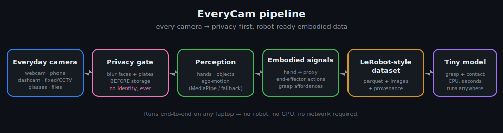

# EveryCam, explained for everyone 🎥🤖

*No computer science needed. If you can use a phone camera, you can understand this — and even help.*

## The one-sentence version

**EveryCam turns ordinary videos — from your webcam, phone, dashcam, or smart glasses — into
"lessons" that robots can learn from, while automatically blurring people's faces so privacy
is protected.**

## Why does this matter?

Robots are amazing at some things (welding the same car part a million times) and surprisingly
**bad** at simple things you do without thinking — picking up a cup, folding a shirt, opening a
drawer. Why? Because to learn a physical skill, a robot needs to see **thousands of examples**,
and collecting those with real robots is slow and very expensive.

Here's the clever idea the whole field is chasing right now: **humans already do these tasks all
day, on camera.** Your hands pouring cereal, tying a shoe, or wiping a table are exactly the
examples a robot needs. If we can turn "a human hand doing a thing in a video" into something a
robot can read, then robots can learn from *us* — from cheap, everyday cameras instead of costly
robot farms.

That conversion — *everyday video → robot lesson* — is what EveryCam does.

## How it works (in 5 steps)

Think of it like an assembly line for a video clip:

1. **📷 Camera** — any everyday camera gives EveryCam a video (live or a recorded file).
2. **🕶️ Privacy first** — *before anything is saved*, EveryCam blurs faces and license plates.
   It never tries to figure out *who* anyone is.
3. **✋ Look** — it finds the **hand** and the **objects** in each frame.
4. **➡️ Translate** — it turns the hand's movement into a **"robot action"** (move here, then
   here) and marks the **grab point** on the object ("this is where you'd pick it up").
5. **📦 Save + learn** — it saves everything as a tidy dataset, and a small AI practices
   predicting the grab points. If it learns well, the data is good!

## The technologies — in plain words

| You'll hear… | It really means… |
|---|---|
| **Physical AI / Embodied AI** | AI that acts in the *real world* (robots), not just text on a screen. |
| **Computer vision** | Teaching computers to "see" — find hands, objects, and movement in pictures. |
| **Hand tracking** (MediaPipe) | Software that locates the points of a hand (knuckles, fingertips) in a video. |
| **Affordance** | A fancy word for "what can I do with this / where do I grab it?" |
| **Imitation learning** | Robots learning by *copying* a demonstration — like you learning a dance by watching. |
| **Action** | The instruction "move from here to there" that a robot can follow. |
| **Dataset** | A neat, organized pile of examples used to train AI. EveryCam uses the **LeRobot** format so robot tools can read it. |
| **World model** | An AI's "imagination" — guessing what happens next in a scene. |
| **Anonymization** | Removing things that identify a person (here: blurring faces and plates). |
| **Open source** | The code is free and public so anyone can use it, learn from it, and improve it. |
| **GitHub** | The website where the code lives and where people team up on it. |
| **Pull request (PR)** | A polite "here's my change — want to add it?" proposal on GitHub. |
| **CI** (continuous integration) | A robot helper on GitHub that auto-checks every change. |

## The part that makes it special: privacy 🛡️

Lots of projects grab as much video as possible and worry about privacy later. EveryCam does the
opposite: **privacy is built into the first step.** Faces and plates are blurred *before* a frame
is ever stored, and the project has **no ability to recognize or track individuals**. When you
share data the "lightweight" way, only the *numbers* (where the hand moved) are uploaded — **never
the actual video of people.**

## How *you* can help (yes, you!)

You don't need to be a programmer:

- **Contribute a clip** of your hands doing an everyday task (your own webcam or phone). EveryCam
  blurs faces and turns it into a robot lesson. See [CONTRIBUTING-DATA.md](../CONTRIBUTING-DATA.md)
  or use the website's contribute form.
- **Tell a friend** — more contributors = a better open dataset for everyone.
- **Suggest ideas** by opening an "issue" on GitHub.

> Golden rule: only share videos you have the right to share, where everyone in them is you or has
> said yes. When in doubt, don't.

## Want the technical version?

Head back to the main [README](../README.md) for the architecture, benchmarks, and install steps.
